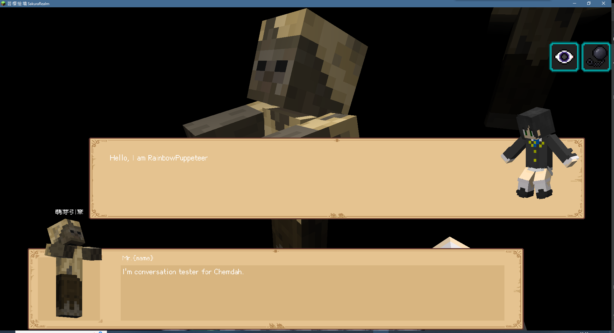
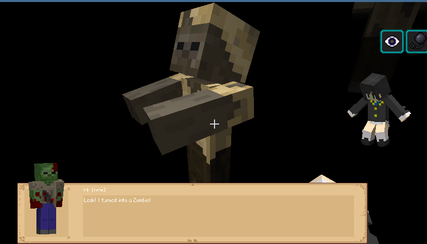

### SrChemDialog 一个萌芽主题的对话框实现

#### 1. 介绍
这个插件是为绘境开发的对话插件，是Chemdah和萌芽的附属。开发的初衷是满足一些现有市面上的对话插件无法满足的需求，比如说，显示除了鼠标指针
正对着的npc之外的npc的模型，以及可以让玩家像npc一样说话，而不是只能用选项来回答等。之后会有更多的功能加入进来，比如假的玩家选项，一键
跳过对话，自动播放和查看对话记录等。

本款插件相较于其他插件的优势在于，
1. 首先它可以兼容Chemdah的全部功能，并在此之上进行了非常易于上手的拓展。
2. 其次，它的代码十分简洁，且使用了 萌芽最新的客户端API，大大提高了性能。
3. 最后，本款插件将会持续更新，而且永久免费开源。作者也会一直维护下去，欢迎大家提出建议和指出bug。

作者还是第一次使用Kotlin和TabooLib开发插件，所以代码写的不是很好，欢迎大家指出问题。

作者QQ：_1149470063_

联系作者： [邮箱](mailto:c233zhao@uwaterloo.ca)

支持绘境：[Bilibili](https://space.bilibili.com/4194287?spm_id_from=333.1007.0.0)

#### 2. 使用方法
1. 安装`Chemdah`插件版本号`0.3.30`, `GermPlugin`插件版本号`4.3.9-20`. **注意：萌芽本地模组版本低于4.3.9-20会导致报错.**
2. 将Chemdah对话的主题（theme）修改为`sr-dialog`.
3. 修改`plugins/SrChemDialog/default.yml`中的所有贴图为你自己的贴图。所有控件的位置也都可以随意修改。

### 3. 功能介绍
#### 3.1. 玩家发言
在对话中的npc部分对话的开头写入`$$player$$`即可将这个对话转变为玩家的发言。例如：
```yaml
conversation_0:
  npc id: 'adyeshach test2'
  npc:
    - 'Hi! {{ sender }}.'
    - 'I''m conversation tester for Chemdah.'
    - '$$player$$Hello, I am {{ sender }}!'
    - '$$player$$Nice to meet you!'
    - 'Do you like to play a game with me?'
  format: generic
  player:
    - reply: 'Sure!'
      then: &ab |
        goto conversation_0_1
```
效果展示：


#### 3.2. 显示npc模型
在对话中的npc部分对话的开头写入`$$model:name$$`即可将这个对话显示的模型转变为显示对应的模型。例如：
```yaml
conversation_0_1:
  npc:
    - '$$husk:古老的腐臭尸骸$$Look! I turned into a Zombie!'
  format: generic
  player:
    - reply: 'Cool!'
      then: |
        set game true
        goto conversation_0_2
```
效果展示：

要注意的是，使用这个功能需要配置好萌芽或者其他用于替换模型皮肤的插件。这个功能的本质是显示了一个名字为`name`，
类型为`model`的实体。
